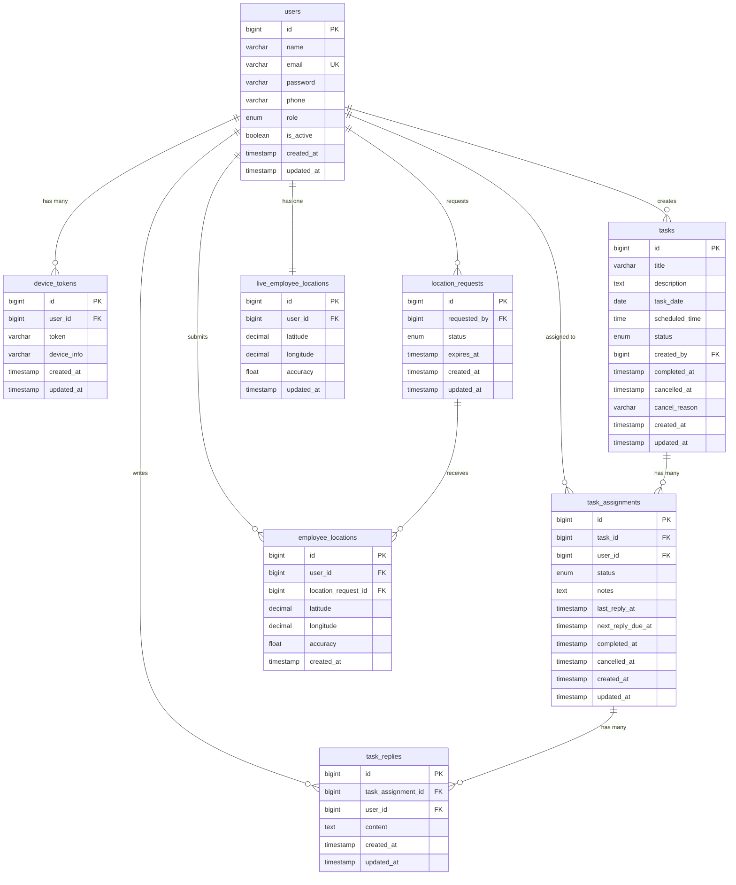
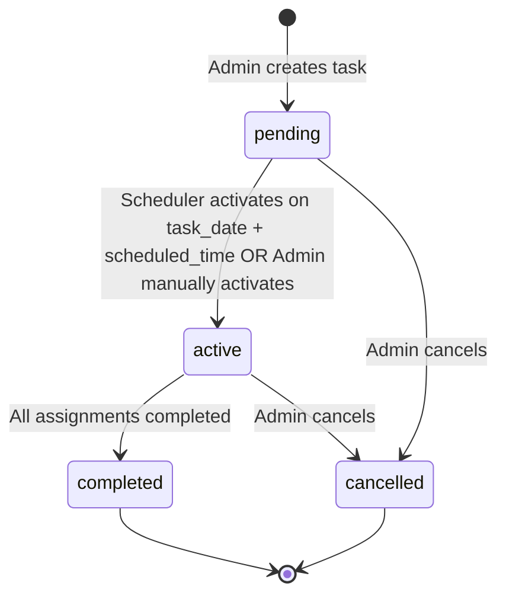
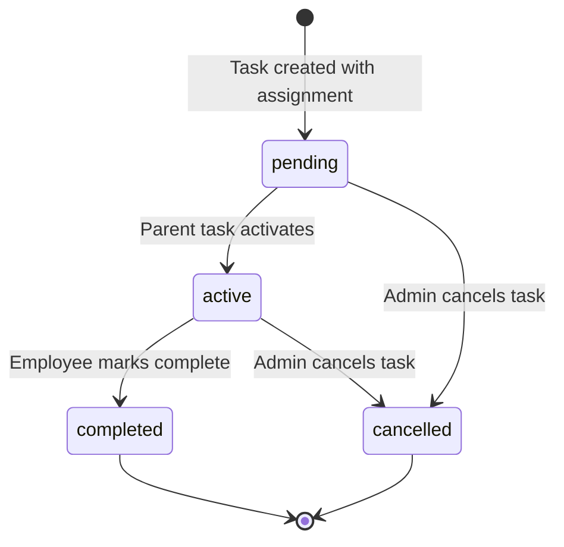

# Factory Task Management App — Technical Backend Plan (Part 1)

**Company:** Engineering Technologies
**Stack:** Laravel REST API · MySQL · Sanctum · FCM · Flutter Android
**Version:** 1.0 MVP
**Date:** 2026-05-02

---

## 1. Executive Technical Summary

The Factory Task Management App is a task-driven workforce management system for a single factory. An **Admin/Factory Manager** creates daily tasks, assigns them to employees, and monitors progress through mandatory hourly updates. Location tracking operates **on-demand** — the admin requests locations, employees respond via FCM-triggered submissions.

**Architecture:** Stateless REST API consumed by a Flutter Android app. Authentication via Laravel Sanctum (token-based). Push notifications via Firebase Cloud Messaging (data messages). No WebSockets in MVP — polling + FCM covers all real-time needs.

**Key design decisions:**
- Single-admin system (no multi-tenancy)
- Task → TaskAssignment (1:N) pattern separates group tasks from individual accountability
- Each employee has independent progress tracking (`last_reply_at`, `next_reply_due_at`)
- Parent task auto-completes only when ALL assignments complete
- Location is request-response, not continuous tracking

---

## 2. Final Feature Scope

| Module | Features |
|---|---|
| **Auth** | Admin/employee login, Sanctum tokens, FCM device token registration, logout (revoke token) |
| **User Management** | Admin creates/edits/deactivates employees, list employees, share credentials via WhatsApp (client-side) |
| **Tasks** | CRUD tasks, assign to multiple employees, set `task_date`, edit/cancel tasks |
| **Task Assignments** | Per-employee assignment tracking, lifecycle management, constraint: 1 active/pending per employee |
| **Task Replies** | Hourly mandatory progress updates per assignment |
| **Scheduler** | Auto-activate due tasks, send hourly reply reminders via FCM, optionally expire overdue tasks |
| **Location** | On-demand location requests, FCM trigger, employee submission, admin reads live locations |
| **FCM** | 6 notification types: assigned, activated, hourly reminder, updated, cancelled, location requested |

---

## 3. MVP Scope & Future Enhancements

### MVP (v1.0)
- [x] Auth with Sanctum + device token management
- [x] Admin user management (create, edit, deactivate, list)
- [x] Task CRUD with daily `task_date`
- [x] Task assignment with 1-active constraint
- [x] Hourly reply system with scheduler reminders
- [x] Task/assignment lifecycle (pending → active → completed/cancelled)
- [x] On-demand location tracking via FCM
- [x] All 6 FCM notification types
- [x] Polling-based live location reads

### Future Enhancements
- WebSocket for real-time updates
- File attachments on replies
- Reporting & analytics dashboard
- In-app notification history
- Multi-factory / multi-admin support
- Geofencing & continuous tracking mode
- Task templates & recurring tasks

---

## 4. Final Database Schema

### `users`
| Column | Type | Constraints | Notes |
|---|---|---|---|
| `id` | BIGINT UNSIGNED | PK, AI | |
| `name` | VARCHAR(255) | NOT NULL | |
| `email` | VARCHAR(255) | UNIQUE, NOT NULL | Used for login |
| `password` | VARCHAR(255) | NOT NULL | Hashed |
| `phone` | VARCHAR(20) | NULLABLE | For WhatsApp sharing |
| `role` | ENUM('admin','employee') | NOT NULL, DEFAULT 'employee' | |
| `is_active` | BOOLEAN | DEFAULT true | Soft-disable without delete |
| `created_at` | TIMESTAMP | | |
| `updated_at` | TIMESTAMP | | |

**Indexes:** `email` (unique), `role`, `is_active`

---

### `device_tokens`
| Column | Type | Constraints | Notes |
|---|---|---|---|
| `id` | BIGINT UNSIGNED | PK, AI | |
| `user_id` | BIGINT UNSIGNED | FK → users.id, NOT NULL | |
| `token` | VARCHAR(500) | NOT NULL | FCM token |
| `device_info` | VARCHAR(255) | NULLABLE | Device model/OS |
| `created_at` | TIMESTAMP | | |
| `updated_at` | TIMESTAMP | | |

**Indexes:** `user_id`, UNIQUE(`user_id`, `token`)

---

### `tasks`
| Column | Type | Constraints | Notes |
|---|---|---|---|
| `id` | BIGINT UNSIGNED | PK, AI | |
| `title` | VARCHAR(255) | NOT NULL | |
| `description` | TEXT | NULLABLE | |
| `task_date` | DATE | NOT NULL | The day this task is for |
| `scheduled_time` | TIME | NULLABLE | When task should auto-activate |
| `status` | ENUM('pending','active','completed','cancelled') | DEFAULT 'pending' | |
| `created_by` | BIGINT UNSIGNED | FK → users.id | Admin who created |
| `completed_at` | TIMESTAMP | NULLABLE | When all assignments done |
| `cancelled_at` | TIMESTAMP | NULLABLE | |
| `cancel_reason` | VARCHAR(500) | NULLABLE | |
| `created_at` | TIMESTAMP | | |
| `updated_at` | TIMESTAMP | | |

**Indexes:** `task_date`, `status`, `created_by`, (`task_date`, `status`)

---

### `task_assignments`
| Column | Type | Constraints | Notes |
|---|---|---|---|
| `id` | BIGINT UNSIGNED | PK, AI | |
| `task_id` | BIGINT UNSIGNED | FK → tasks.id, NOT NULL | |
| `user_id` | BIGINT UNSIGNED | FK → users.id, NOT NULL | Assigned employee |
| `status` | ENUM('pending','active','completed','cancelled') | DEFAULT 'pending' | |
| `notes` | TEXT | NULLABLE | Admin notes for this employee |
| `last_reply_at` | TIMESTAMP | NULLABLE | Last progress update |
| `next_reply_due_at` | TIMESTAMP | NULLABLE | Set when activated, +1hr each reply |
| `completed_at` | TIMESTAMP | NULLABLE | |
| `cancelled_at` | TIMESTAMP | NULLABLE | |
| `created_at` | TIMESTAMP | | |
| `updated_at` | TIMESTAMP | | |

**Indexes:** `task_id`, `user_id`, `status`, (`user_id`, `status`), UNIQUE(`task_id`, `user_id`)

---

### `task_replies`
| Column | Type | Constraints | Notes |
|---|---|---|---|
| `id` | BIGINT UNSIGNED | PK, AI | |
| `task_assignment_id` | BIGINT UNSIGNED | FK → task_assignments.id | |
| `user_id` | BIGINT UNSIGNED | FK → users.id | Denormalized for quick queries |
| `content` | TEXT | NOT NULL | Progress update text |
| `created_at` | TIMESTAMP | | |
| `updated_at` | TIMESTAMP | | |

**Indexes:** `task_assignment_id`, `user_id`, `created_at`

---

### `location_requests`
| Column | Type | Constraints | Notes |
|---|---|---|---|
| `id` | BIGINT UNSIGNED | PK, AI | |
| `requested_by` | BIGINT UNSIGNED | FK → users.id | Admin |
| `status` | ENUM('active','expired') | DEFAULT 'active' | |
| `expires_at` | TIMESTAMP | NULLABLE | Auto-expire after N minutes |
| `created_at` | TIMESTAMP | | |
| `updated_at` | TIMESTAMP | | |

**Indexes:** `requested_by`, `status`

---

### `employee_locations`
| Column | Type | Constraints | Notes |
|---|---|---|---|
| `id` | BIGINT UNSIGNED | PK, AI | |
| `user_id` | BIGINT UNSIGNED | FK → users.id | |
| `location_request_id` | BIGINT UNSIGNED | FK → location_requests.id, NULLABLE | |
| `latitude` | DECIMAL(10,7) | NOT NULL | |
| `longitude` | DECIMAL(10,7) | NOT NULL | |
| `accuracy` | FLOAT | NULLABLE | GPS accuracy in meters |
| `created_at` | TIMESTAMP | | |

**Indexes:** `user_id`, `location_request_id`, `created_at`

---

### `live_employee_locations`
| Column | Type | Constraints | Notes |
|---|---|---|---|
| `id` | BIGINT UNSIGNED | PK, AI | |
| `user_id` | BIGINT UNSIGNED | FK → users.id, UNIQUE | One row per employee |
| `latitude` | DECIMAL(10,7) | NOT NULL | |
| `longitude` | DECIMAL(10,7) | NOT NULL | |
| `accuracy` | FLOAT | NULLABLE | |
| `updated_at` | TIMESTAMP | | Last known location time |

**Indexes:** `user_id` (unique) — uses `updateOrCreate` pattern

---

## 5. Mermaid ERD



---

## 6. API Endpoint List

### Auth Module
| Method | Endpoint | Auth | Role | Description |
|---|---|---|---|---|
| POST | `/api/auth/login` | No | Any | Login, returns Sanctum token |
| POST | `/api/auth/logout` | Yes | Any | Revoke current token |
| GET | `/api/auth/me` | Yes | Any | Get authenticated user profile |
| POST | `/api/auth/device-token` | Yes | Any | Register/update FCM device token |
| DELETE | `/api/auth/device-token` | Yes | Any | Remove FCM device token |

### User Management Module (Admin only)
| Method | Endpoint | Auth | Role | Description |
|---|---|---|---|---|
| GET | `/api/admin/employees` | Yes | Admin | List all employees |
| POST | `/api/admin/employees` | Yes | Admin | Create employee account |
| GET | `/api/admin/employees/{id}` | Yes | Admin | Get employee details |
| PUT | `/api/admin/employees/{id}` | Yes | Admin | Update employee |
| PATCH | `/api/admin/employees/{id}/toggle-active` | Yes | Admin | Activate/deactivate employee |

### Task Module
| Method | Endpoint | Auth | Role | Description |
|---|---|---|---|---|
| GET | `/api/tasks` | Yes | Both | List tasks (admin: all, employee: own) |
| POST | `/api/tasks` | Yes | Admin | Create task with assignments |
| GET | `/api/tasks/{id}` | Yes | Both | Task detail with assignments |
| PUT | `/api/tasks/{id}` | Yes | Admin | Update task |
| PATCH | `/api/tasks/{id}/cancel` | Yes | Admin | Cancel task + all assignments |
| PATCH | `/api/tasks/{id}/activate` | Yes | Admin | Manually activate a pending task |

### Task Assignment Module
| Method | Endpoint | Auth | Role | Description |
|---|---|---|---|---|
| GET | `/api/assignments/my-current` | Yes | Employee | Get current active/pending assignment |
| PATCH | `/api/assignments/{id}/complete` | Yes | Employee | Mark own assignment complete |

### Task Reply Module
| Method | Endpoint | Auth | Role | Description |
|---|---|---|---|---|
| POST | `/api/assignments/{id}/replies` | Yes | Employee | Submit hourly progress update |
| GET | `/api/assignments/{id}/replies` | Yes | Both | List replies for an assignment |

### Location Module
| Method | Endpoint | Auth | Role | Description |
|---|---|---|---|---|
| POST | `/api/location/request` | Yes | Admin | Create location request + FCM push |
| POST | `/api/location/submit` | Yes | Employee | Submit current location |
| GET | `/api/location/live` | Yes | Admin | Get all employees' last known locations |
| GET | `/api/location/live/{userId}` | Yes | Admin | Get single employee location |

---

## 7. Request/Response Examples

### POST `/api/auth/login`
**Request:**
```json
{
  "email": "admin@factory.com",
  "password": "secret123"
}
```
**Response (200):**
```json
{
  "success": true,
  "data": {
    "user": {
      "id": 1,
      "name": "Factory Manager",
      "email": "admin@factory.com",
      "role": "admin",
      "is_active": true
    },
    "token": "1|abc123tokenstring..."
  },
  "message": "Login successful"
}
```

### POST `/api/admin/employees`
**Request:**
```json
{
  "name": "Ahmad Ali",
  "email": "ahmad@factory.com",
  "password": "emp12345",
  "phone": "+963912345678"
}
```
**Response (201):**
```json
{
  "success": true,
  "data": {
    "id": 5,
    "name": "Ahmad Ali",
    "email": "ahmad@factory.com",
    "phone": "+963912345678",
    "role": "employee",
    "is_active": true,
    "plain_password": "emp12345"
  },
  "message": "Employee created successfully"
}
```

> [!NOTE]
> `plain_password` is returned **only on creation** so the admin can share it via WhatsApp. It is never stored in plain text.

### POST `/api/tasks`
**Request:**
```json
{
  "title": "Machine A Maintenance",
  "description": "Full inspection and oil change",
  "task_date": "2026-05-03",
  "scheduled_time": "08:00",
  "employee_ids": [2, 3, 5],
  "assignment_notes": {
    "2": "Handle motor inspection",
    "3": "Oil change and filter replacement",
    "5": "Electrical wiring check"
  }
}
```
**Response (201):**
```json
{
  "success": true,
  "data": {
    "id": 10,
    "title": "Machine A Maintenance",
    "description": "Full inspection and oil change",
    "task_date": "2026-05-03",
    "scheduled_time": "08:00",
    "status": "pending",
    "assignments": [
      {
        "id": 20,
        "user_id": 2,
        "user_name": "Ahmad Ali",
        "status": "pending",
        "notes": "Handle motor inspection"
      },
      {
        "id": 21,
        "user_id": 3,
        "user_name": "Salem Khaled",
        "status": "pending",
        "notes": "Oil change and filter replacement"
      },
      {
        "id": 22,
        "user_id": 5,
        "user_name": "Omar Hassan",
        "status": "pending",
        "notes": "Electrical wiring check"
      }
    ]
  },
  "message": "Task created successfully"
}
```

### POST `/api/assignments/{id}/replies`
**Request:**
```json
{
  "content": "Motor inspection 60% done. Found minor wear on bearing #3."
}
```
**Response (201):**
```json
{
  "success": true,
  "data": {
    "id": 100,
    "task_assignment_id": 20,
    "content": "Motor inspection 60% done. Found minor wear on bearing #3.",
    "created_at": "2026-05-03T09:00:00Z"
  },
  "message": "Reply submitted successfully"
}
```

### POST `/api/location/request`
**Request:**
```json
{
  "employee_ids": [2, 3, 5]
}
```
**Response (200):**
```json
{
  "success": true,
  "data": {
    "location_request_id": 15,
    "employees_notified": 3,
    "expires_at": "2026-05-03T09:10:00Z"
  },
  "message": "Location request sent"
}
```

### POST `/api/location/submit`
**Request:**
```json
{
  "latitude": 33.5138,
  "longitude": 36.2765,
  "accuracy": 12.5
}
```
**Response (200):**
```json
{
  "success": true,
  "message": "Location submitted"
}
```

### GET `/api/location/live`
**Response (200):**
```json
{
  "success": true,
  "data": [
    {
      "user_id": 2,
      "name": "Ahmad Ali",
      "latitude": 33.5138,
      "longitude": 36.2765,
      "accuracy": 12.5,
      "updated_at": "2026-05-03T09:01:15Z"
    },
    {
      "user_id": 3,
      "name": "Salem Khaled",
      "latitude": 33.5200,
      "longitude": 36.2800,
      "accuracy": 8.0,
      "updated_at": "2026-05-03T09:01:22Z"
    }
  ]
}
```

---

## 8. Authentication & Role-Based Access Rules

### Authentication
- **Method:** Laravel Sanctum (token-based)
- **Token lifetime:** No expiry in MVP (revoked on logout)
- **Login:** Email + Password → returns bearer token
- **Every API call** (except login) requires `Authorization: Bearer {token}`

### Role Enforcement
| Resource | Admin | Employee |
|---|---|---|
| Login/Logout | ✅ | ✅ |
| Manage employees | ✅ | ❌ |
| Create/edit/cancel tasks | ✅ | ❌ |
| View all tasks | ✅ | ❌ |
| View own assignments | ✅ | ✅ |
| Submit replies | ❌ | ✅ (own only) |
| Complete assignment | ❌ | ✅ (own only) |
| Request locations | ✅ | ❌ |
| Submit location | ❌ | ✅ |
| View live locations | ✅ | ❌ |

### Implementation
- Use a `CheckRole` middleware: `role:admin`, `role:employee`
- Use Laravel Policies for object-level authorization (e.g., employee can only complete their own assignment)
- Deactivated users (`is_active = false`) are rejected at login and on every authenticated request

---

## 9. Task Lifecycle Flow



**Rules:**
1. Task is created as `pending`
2. Scheduler checks every minute: if `task_date = today` AND `scheduled_time <= now` AND `status = pending` → set to `active`
3. Admin can also manually activate via `PATCH /tasks/{id}/activate`
4. When admin cancels a task → all child assignments are also cancelled
5. Task auto-completes when the **last** active assignment is marked complete
6. Completed/cancelled tasks cannot be reactivated

---

## 10. Assignment Lifecycle Flow



**Rules:**
1. Assignments are created as `pending` when a task is created
2. When parent task becomes `active`, all its assignments become `active`
3. On activation, `next_reply_due_at` = `now + 1 hour`
4. Employee submits reply → `last_reply_at = now`, `next_reply_due_at = now + 1 hour`
5. Employee marks assignment complete → `status = completed`, `completed_at = now`
6. After completion, system checks: if ALL sibling assignments are `completed` → parent task becomes `completed`
7. **Constraint:** An employee cannot receive a new assignment if they already have a `pending` or `active` one

---

*Continued in Part 2 →*
