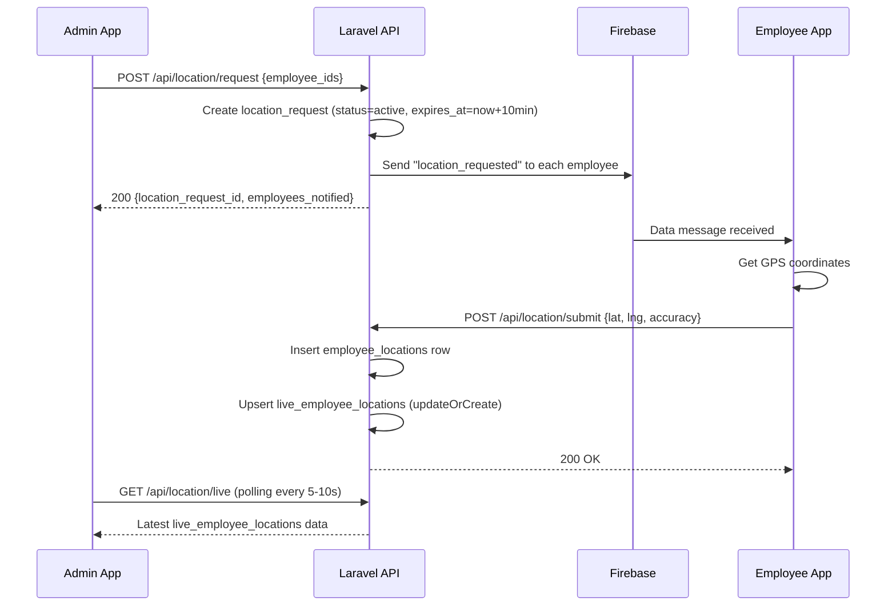

# Factory Task Management App — Technical Backend Plan (Part 2)

*← Continued from Part 1*

---

## 11. Scheduler / Cron Logic

All jobs are registered in `app/Console/Kernel.php`.

### Job 1: Activate Due Tasks
- **Schedule:** Every minute (`everyMinute()`)
- **Logic:**
  ```
  Find tasks WHERE status = 'pending'
    AND task_date = today
    AND scheduled_time <= now
  
  For each task:
    → Set task.status = 'active'
    → Set all assignments.status = 'active'
    → Set all assignments.next_reply_due_at = now + 1 hour
    → Send FCM "task_activated" to all assigned employees
  ```

### Job 2: Send Hourly Reply Reminders
- **Schedule:** Every 5 minutes (`everyFiveMinutes()`)
- **Logic:**
  ```
  Find task_assignments WHERE status = 'active'
    AND next_reply_due_at <= now
    AND last_reply_at < next_reply_due_at (or NULL)
  
  For each overdue assignment:
    → Send FCM "hourly_reply_required" to the employee
    → Optionally increment a missed_replies counter (for future reporting)
  ```

### Job 3: Expire Outdated Tasks (Optional)
- **Schedule:** Daily at midnight (`dailyAt('00:00')`)
- **Logic:**
  ```
  Find tasks WHERE status IN ('pending', 'active')
    AND task_date < today
  
  For each expired task:
    → Set task.status = 'cancelled'
    → Set task.cancel_reason = 'Auto-expired: task date passed'
    → Set all active/pending assignments.status = 'cancelled'
  ```

### Job 4: Expire Location Requests
- **Schedule:** Every minute (`everyMinute()`)
- **Logic:**
  ```
  Find location_requests WHERE status = 'active'
    AND expires_at <= now
  
  → Set status = 'expired'
  ```

---

## 12. FCM Notification Types & Payloads

All FCM messages use **data-only messages** (no `notification` key) so the Flutter app handles display in all states.

### 12.1 `task_assigned`
**Trigger:** Admin creates a task with assignments
```json
{
  "data": {
    "type": "task_assigned",
    "task_id": "10",
    "task_title": "Machine A Maintenance",
    "task_date": "2026-05-03",
    "assignment_id": "20",
    "notes": "Handle motor inspection",
    "title": "New Task Assigned",
    "body": "You have been assigned to: Machine A Maintenance"
  }
}
```

### 12.2 `task_activated`
**Trigger:** Task transitions from pending → active
```json
{
  "data": {
    "type": "task_activated",
    "task_id": "10",
    "task_title": "Machine A Maintenance",
    "assignment_id": "20",
    "title": "Task Started",
    "body": "Machine A Maintenance is now active. First update due in 1 hour."
  }
}
```

### 12.3 `hourly_reply_required`
**Trigger:** Scheduler detects overdue `next_reply_due_at`
```json
{
  "data": {
    "type": "hourly_reply_required",
    "task_id": "10",
    "task_title": "Machine A Maintenance",
    "assignment_id": "20",
    "title": "Progress Update Required",
    "body": "Please submit your hourly progress update for: Machine A Maintenance"
  }
}
```

### 12.4 `task_updated`
**Trigger:** Admin edits task title, description, or assignment notes
```json
{
  "data": {
    "type": "task_updated",
    "task_id": "10",
    "task_title": "Machine A Maintenance (Updated)",
    "assignment_id": "20",
    "title": "Task Updated",
    "body": "Machine A Maintenance has been updated by the manager."
  }
}
```

### 12.5 `task_cancelled`
**Trigger:** Admin cancels a task
```json
{
  "data": {
    "type": "task_cancelled",
    "task_id": "10",
    "task_title": "Machine A Maintenance",
    "assignment_id": "20",
    "cancel_reason": "Parts not available",
    "title": "Task Cancelled",
    "body": "Machine A Maintenance has been cancelled."
  }
}
```

### 12.6 `location_requested`
**Trigger:** Admin requests employee locations
```json
{
  "data": {
    "type": "location_requested",
    "location_request_id": "15",
    "title": "Location Request",
    "body": "Your manager is requesting your current location."
  }
}
```

---

## 13. Location Request Flow



**Key rules:**
- Location requests expire after **10 minutes** (configurable)
- `live_employee_locations` stores only the **latest** location per employee (upsert)
- `employee_locations` keeps a **history log** of all submissions
- Admin app polls `GET /api/location/live` every 5–10 seconds while map is open
- Employee app should respond to FCM within a reasonable time (handled client-side)

---

## 14. Validation Rules

### Auth
| Field | Rules |
|---|---|
| `email` | required, email, exists:users,email |
| `password` | required, string, min:6 |

### Employee Management
| Field | Rules |
|---|---|
| `name` | required, string, max:255 |
| `email` | required, email, unique:users,email |
| `password` | required, string, min:6, max:50 |
| `phone` | nullable, string, max:20 |

### Task Creation
| Field | Rules |
|---|---|
| `title` | required, string, max:255 |
| `description` | nullable, string |
| `task_date` | required, date, after_or_equal:today |
| `scheduled_time` | nullable, date_format:H:i |
| `employee_ids` | required, array, min:1 |
| `employee_ids.*` | required, exists:users,id (must be active employees) |
| `assignment_notes` | nullable, array |
| `assignment_notes.*` | nullable, string |

**Custom rule:** Each employee in `employee_ids` must NOT have an existing `pending` or `active` assignment.

### Task Reply
| Field | Rules |
|---|---|
| `content` | required, string, min:5, max:2000 |

### Location Submit
| Field | Rules |
|---|---|
| `latitude` | required, numeric, between:-90,90 |
| `longitude` | required, numeric, between:-180,180 |
| `accuracy` | nullable, numeric, min:0 |

### Location Request
| Field | Rules |
|---|---|
| `employee_ids` | nullable, array (if null → all active employees) |
| `employee_ids.*` | exists:users,id |

---

## 15. Error Response Format

All API errors follow a consistent JSON structure:

```json
{
  "success": false,
  "message": "Human-readable error description",
  "errors": {
    "field_name": ["Validation error message 1", "Validation error message 2"]
  }
}
```

### HTTP Status Codes Used
| Code | Usage |
|---|---|
| `200` | Success |
| `201` | Resource created |
| `401` | Unauthenticated (invalid/missing token) |
| `403` | Forbidden (wrong role or not owner) |
| `404` | Resource not found |
| `409` | Conflict (e.g., employee already has active assignment) |
| `422` | Validation error |
| `500` | Server error |

### Example Error Responses
**401 Unauthenticated:**
```json
{
  "success": false,
  "message": "Unauthenticated. Please log in."
}
```

**409 Conflict (employee busy):**
```json
{
  "success": false,
  "message": "Cannot assign task to the following employees.",
  "errors": {
    "employee_ids": ["Employee Ahmad Ali already has an active assignment (Task #8)."]
  }
}
```

**422 Validation:**
```json
{
  "success": false,
  "message": "The given data was invalid.",
  "errors": {
    "title": ["The title field is required."],
    "task_date": ["The task date must be a date after or equal to today."]
  }
}
```

---

## 16. Suggested Laravel Folder Structure

```
app/
├── Console/
│   ├── Kernel.php
│   └── Commands/
│       ├── ActivateDueTasks.php
│       ├── SendReplyReminders.php
│       ├── ExpireOutdatedTasks.php
│       └── ExpireLocationRequests.php
├── Enums/
│   ├── UserRole.php
│   ├── TaskStatus.php
│   ├── AssignmentStatus.php
│   └── LocationRequestStatus.php
├── Http/
│   ├── Controllers/
│   │   └── Api/
│   │       ├── AuthController.php
│   │       ├── EmployeeController.php
│   │       ├── TaskController.php
│   │       ├── TaskAssignmentController.php
│   │       ├── TaskReplyController.php
│   │       └── LocationController.php
│   ├── Middleware/
│   │   ├── CheckRole.php
│   │   └── CheckActiveUser.php
│   ├── Requests/
│   │   ├── Auth/
│   │   │   └── LoginRequest.php
│   │   ├── Employee/
│   │   │   ├── StoreEmployeeRequest.php
│   │   │   └── UpdateEmployeeRequest.php
│   │   ├── Task/
│   │   │   ├── StoreTaskRequest.php
│   │   │   └── UpdateTaskRequest.php
│   │   ├── Reply/
│   │   │   └── StoreReplyRequest.php
│   │   └── Location/
│   │       ├── RequestLocationRequest.php
│   │       └── SubmitLocationRequest.php
│   └── Resources/
│       ├── UserResource.php
│       ├── TaskResource.php
│       ├── TaskAssignmentResource.php
│       ├── TaskReplyResource.php
│       └── LocationResource.php
├── Models/
│   ├── User.php
│   ├── DeviceToken.php
│   ├── Task.php
│   ├── TaskAssignment.php
│   ├── TaskReply.php
│   ├── LocationRequest.php
│   ├── EmployeeLocation.php
│   └── LiveEmployeeLocation.php
├── Notifications/  (not used in MVP — FCM is handled via Service)
├── Policies/
│   ├── TaskPolicy.php
│   └── TaskAssignmentPolicy.php
├── Services/
│   ├── FcmService.php
│   ├── TaskService.php
│   ├── AssignmentService.php
│   └── LocationService.php
├── Observers/
│   └── TaskAssignmentObserver.php  (auto-check parent task completion)
├── Traits/
│   └── ApiResponse.php  (success/error response helpers)
config/
├── fcm.php  (FCM credentials config)
database/
├── migrations/
│   ├── xxxx_create_users_table.php
│   ├── xxxx_create_device_tokens_table.php
│   ├── xxxx_create_tasks_table.php
│   ├── xxxx_create_task_assignments_table.php
│   ├── xxxx_create_task_replies_table.php
│   ├── xxxx_create_location_requests_table.php
│   ├── xxxx_create_employee_locations_table.php
│   └── xxxx_create_live_employee_locations_table.php
├── seeders/
│   └── AdminSeeder.php
routes/
├── api.php
```

---

## 17. Development Phases

### Phase 1: Foundation & Auth (3–4 days)
- Laravel project setup, MySQL config
- User model, migration, seeder (admin account)
- Sanctum auth (login, logout, me)
- Device token registration
- `CheckRole` and `CheckActiveUser` middleware
- `ApiResponse` trait

### Phase 2: Employee Management (2 days)
- Employee CRUD endpoints
- Toggle active/deactivate
- Employee list with filters
- Form request validation

### Phase 3: Task & Assignment System (4–5 days)
- Task CRUD with assignment creation
- Assignment constraint validation (1 active per employee)
- Task/assignment lifecycle transitions
- Auto-complete parent task via Observer
- Task cancel (cascade to assignments)
- API resources for structured responses

### Phase 4: Reply System (2–3 days)
- Task reply submission endpoint
- Update `last_reply_at` and `next_reply_due_at`
- Reply listing endpoint
- Validation (only active assignments, content rules)

### Phase 5: Scheduler & Automation (2–3 days)
- `ActivateDueTasks` command
- `SendReplyReminders` command
- `ExpireOutdatedTasks` command
- `ExpireLocationRequests` command
- Cron registration in Kernel

### Phase 6: FCM Integration (3–4 days)
- `FcmService` implementation
- All 6 notification types
- Integration with task creation, activation, cancellation, updates
- Integration with scheduler commands
- Testing with real Android device

### Phase 7: Location System (2–3 days)
- Location request endpoint
- Location submit endpoint
- Live location polling endpoint
- FCM trigger on request
- Location request expiry

### Phase 8: Testing & Polish (3–4 days)
- End-to-end API testing
- Edge case handling
- Error response consistency
- Performance review (N+1 queries, indexes)
- API documentation (Postman collection or similar)

**Total estimated: 21–28 days**

---

## 18. Acceptance Criteria Per Phase

### Phase 1: Foundation & Auth
- [ ] Admin can log in with email/password and receive a Sanctum token
- [ ] Authenticated requests without a valid token return 401
- [ ] `/api/auth/me` returns the correct user profile
- [ ] Logout revokes the token; subsequent requests fail
- [ ] FCM device token can be registered and removed
- [ ] Role middleware blocks employees from admin routes

### Phase 2: Employee Management
- [ ] Admin can create an employee and receive `plain_password` in response
- [ ] Duplicate email returns 422
- [ ] Admin can list, view, update, and deactivate employees
- [ ] Deactivated employee cannot log in
- [ ] Employee cannot access admin endpoints (403)

### Phase 3: Task & Assignment System
- [ ] Admin can create a task and assign it to 1+ employees
- [ ] Assigning to an employee with an active/pending assignment returns 409
- [ ] Task detail includes all assignments with employee info
- [ ] Admin can cancel a task; all assignments are also cancelled
- [ ] When the last assignment is completed, the parent task becomes `completed`
- [ ] Employee can view only their own tasks/assignments

### Phase 4: Reply System
- [ ] Employee can submit a reply to their active assignment
- [ ] Reply updates `last_reply_at` and resets `next_reply_due_at` to +1 hour
- [ ] Submitting a reply to a non-active assignment returns 403
- [ ] Replies are listed in chronological order

### Phase 5: Scheduler & Automation
- [ ] Pending tasks activate at the correct `task_date + scheduled_time`
- [ ] Overdue reply reminders are detected and flagged
- [ ] Outdated tasks (past `task_date`) are auto-cancelled at midnight
- [ ] Expired location requests are cleaned up

### Phase 6: FCM Integration
- [ ] `task_assigned` notification is received on employee device when assigned
- [ ] `task_activated` notification fires on activation
- [ ] `hourly_reply_required` fires when reply is overdue
- [ ] `task_updated` and `task_cancelled` fire on respective actions
- [ ] `location_requested` fires when admin requests locations
- [ ] All notifications are data-only messages

### Phase 7: Location System
- [ ] Admin can request locations for specific employees or all
- [ ] Employees receive FCM push and can submit location
- [ ] Admin can poll `/api/location/live` and see latest positions
- [ ] Location requests expire after configured timeout
- [ ] Historical locations are stored in `employee_locations`

### Phase 8: Testing & Polish
- [ ] All endpoints return consistent JSON format
- [ ] No N+1 query issues on list endpoints
- [ ] All validation rules enforced with proper error messages
- [ ] Postman collection or equivalent documentation available

---

## 19. Risks & Technical Notes

| Risk | Mitigation |
|---|---|
| **FCM token invalidation** | Handle `NotRegistered` errors — remove stale tokens from `device_tokens` |
| **Employee GPS disabled** | Flutter app should check permissions and prompt; backend should not block if location not submitted |
| **Scheduler not running** | Ensure cron job is configured on server: `* * * * * php artisan schedule:run` |
| **Race condition: concurrent assignment** | Use database transaction + `SELECT FOR UPDATE` when checking 1-active constraint |
| **Time zones** | Store all timestamps in UTC. Flutter handles display conversion. Server `APP_TIMEZONE=UTC` |
| **Large employee count** | Current design supports ~50–100 employees comfortably. Beyond that, consider pagination and batch FCM |
| **FCM quota limits** | Firebase allows ~240k messages/min — not a concern for MVP scale |
| **Token leakage** | Enforce HTTPS. `plain_password` returned only once on creation. Never log tokens |
| **Polling overhead** | Location polling (5–10s) is acceptable for MVP. Future: WebSocket for real-time |

### Assumptions
1. Single factory, single admin — no multi-tenancy needed
2. All users are on Android (no iOS in MVP)
3. Server time is UTC; task dates are interpreted in the factory's local timezone
4. The admin has a reliable internet connection for real-time location viewing
5. Employee phones have GPS capability and background execution permissions
6. Firebase project is already created or will be created during Phase 6
7. WhatsApp credential sharing is handled entirely on the Flutter side (deep link / share intent) — no backend involvement
8. `scheduled_time` is in the factory's local timezone; the backend converts to UTC for comparison

---

## 20. Things the Flutter Developer Needs to Know

### Authentication
- Store the Sanctum bearer token securely (e.g., `flutter_secure_storage`)
- Attach `Authorization: Bearer {token}` to every request
- Handle `401` globally — redirect to login screen
- Register FCM device token immediately after login
- Remove device token before logout API call

### FCM Handling
- All push notifications are **data-only** (no `notification` key)
- The app must handle message display in foreground, background, and terminated states
- Parse the `type` field in the data payload to determine the action:
  - `task_assigned` → show notification + refresh task list
  - `task_activated` → show notification + update task status locally
  - `hourly_reply_required` → show persistent/reminder notification
  - `task_updated` → refresh task detail
  - `task_cancelled` → show notification + update UI
  - `location_requested` → silently get GPS and POST to `/api/location/submit`

### Location
- On receiving `location_requested` FCM, automatically:
  1. Request location permission (if not granted)
  2. Get current GPS coordinates
  3. POST to `/api/location/submit`
- This should work even when the app is in the background (use background fetch / workmanager)
- No continuous tracking needed — only respond to on-demand requests

### Task Assignment Constraint
- Before showing "assign employee" UI, call the employee list and check for existing active/pending assignments
- Backend enforces this, but UI should prevent invalid selections for better UX

### Polling
- For live location map: poll `GET /api/location/live` every 5–10 seconds while the map screen is active. Stop polling when the screen is disposed
- For task updates: consider polling every 30–60 seconds or rely on FCM for real-time updates

### Error Handling
- All errors follow the format: `{ success: false, message: "...", errors: {...} }`
- Display `message` to the user for general errors
- Display field-specific errors from `errors` object on form fields
- Handle `409` specifically for assignment conflicts

### WhatsApp Sharing
- Use Android share intent or WhatsApp deep link:
  ```
  https://wa.me/{phone}?text=Your login credentials...
  ```
- Format: `Email: xxx@factory.com | Password: xxx`
- This is entirely client-side; the backend provides `plain_password` only on employee creation

### Date/Time
- All API timestamps are in **UTC** (`ISO 8601` format)
- Convert to local timezone for display
- Send `task_date` as `YYYY-MM-DD` (date only, no time component)
- Send `scheduled_time` as `HH:mm` (24-hour format)

### Offline Considerations
- MVP does not require offline support
- However, cache the current assignment locally for quick access
- If network fails when submitting a reply, queue it and retry

---

> [!IMPORTANT]
> This document covers the complete backend architecture for the Factory Task Management App MVP. No code has been written. Please review all sections and confirm or flag any changes before implementation begins.
